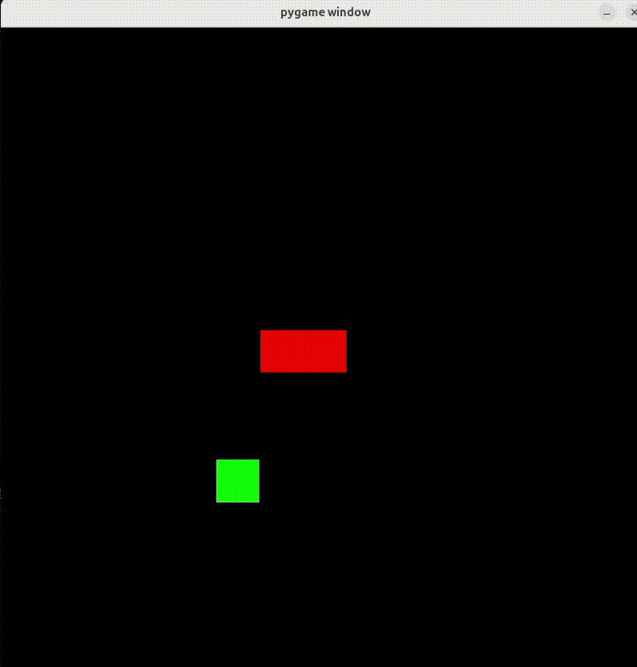
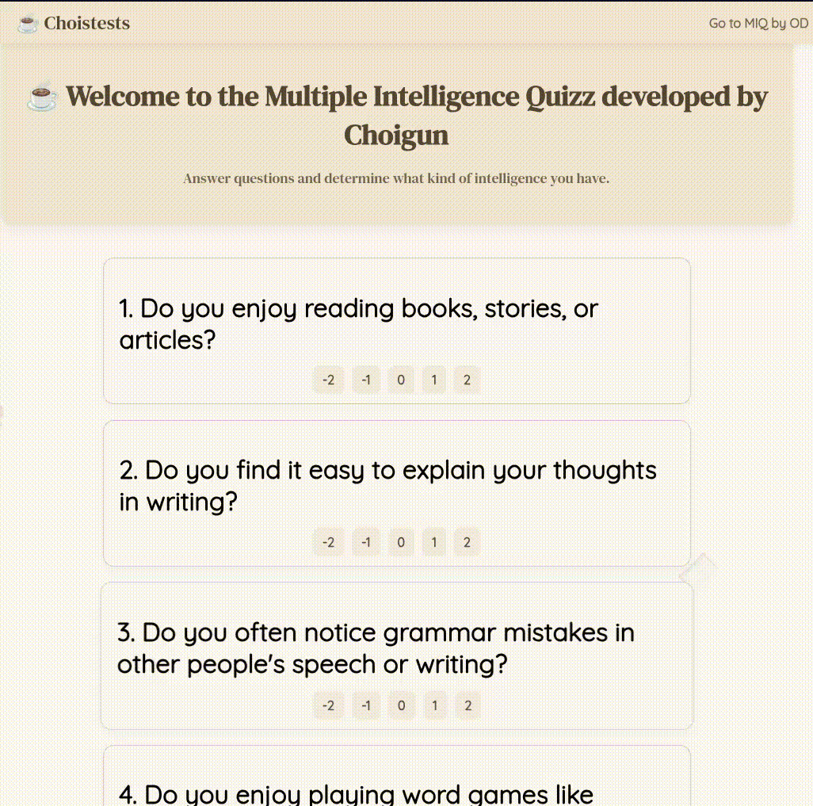
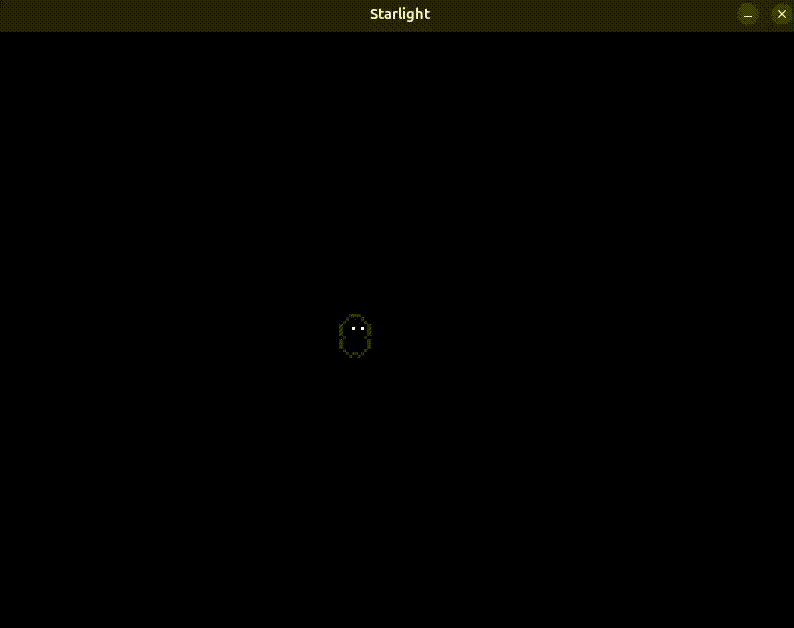
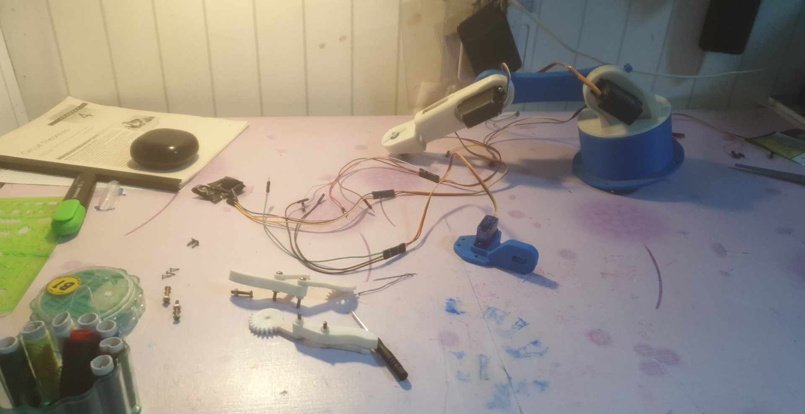

##########  WELCOME TO MY PROJECTS LIBRARY!  ##########

> **AI Projects** <

#########  AI_dev_1
A prototype transformer chatbot model trained with CrossEntropyLoss and batched training.
Built with **C++**, **CMake**, and **LibTorch**.

#########  AI_dev_2  ⭐
An improved prototype transformer chatbot model trained with CrossEntropyLoss.
Built with **C++**, **CMake**, and **LibTorch**.

#########  ai_number_detector  ⭐
A simple linear model for digit recognition, trained with CrossEntropyLoss and batched training.
Built with **Python**, **PyTorch**, and **Pygame**.

#########  ai_snake
A simple linear model that learns to play Snake, trained with SmoothL1Loss and a reward system.
Built with **Python**, **PyTorch**, and **Pygame**.

#########  ai_snake_v2  ⭐
An upgraded Snake AI with batched training, trained using SmoothL1Loss and a reward system.
Built with **Python**, **PyTorch**, and **Pygame**.

> **Education** <

#########  Project_X ⭐
A game created to help kids learn morse code.
Built with **Python** and **Pygame**.

#########  coffe_vibe_MIQ-main ⭐
A website for testing kids’ and adults’ intelligence, based on Howard Gardner’s Multiple Intelligences theory.  
Built with **Python** and **Flask**.

> **Game Development** <

#########  buuz
A game created to present to the parents of my school. It has a plant, that appears randomly, that tries to eat the player while he tries to collect a food called "buuz".
Built with **Python** and **Pygame**.

#########  chaser
My very first game. The player tries to collect coins while a red dot tries to catch him. The player can also teleport with a cooldown of 10 seconds.
Built with **Python** and **Pygame**.

#########  gravity_falls (v1–v3)  ⭐
Inspired by *Level Devil*, this platformer is designed to be as frustratingly difficult as possible.
Built with **Python** and **Pygame**.

#########  horror
An original idea — a horror game where you type words to defeat enemies.
Built with **Go** and **Raylib**.

#########  kingdom (v1)
A decision-making game where you rule a kingdom, balancing currency, happiness, and morality.
Built with **Go** and **Raylib**.

#########  kingdom_v2
A remake of *Kingdom* using a different tech stack.
Built with **Python** and **Pygame**.

#########  Tower of Colors
A multi-level shooter where you fire pixels and dodge enemy attacks.
Built with **Python** and **Pygame**.

#########  Tower of Greens  ⭐
Another multi-level pixel shooter with unique twists.
Built with **Python** and **Pygame**.

> **Robotics** <

#########  Robot_hand_v1  ⭐
A robotic arm built from scratch using 3d printers, arduino Uno, bread boards, batteries. 
Build with **C++** and **Python**.

#########  Robot_hand_v2  ⭐
A robotic arm built from scratch using 3d printers, arduino Uno, bread boards, batteries. 
Build with only **Go**.

